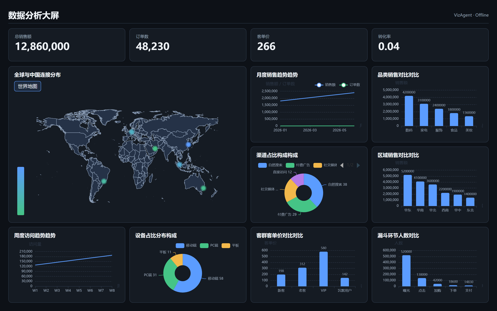
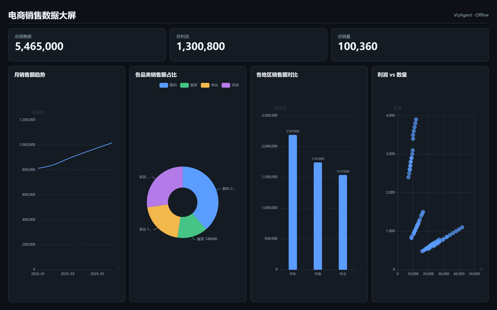
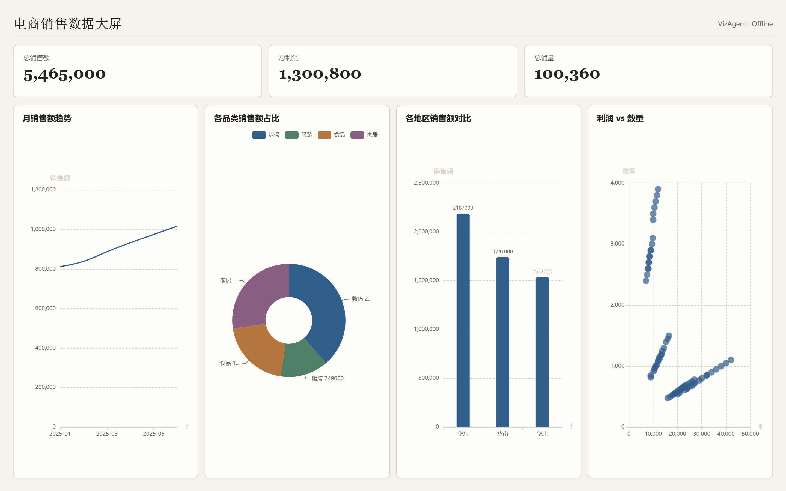
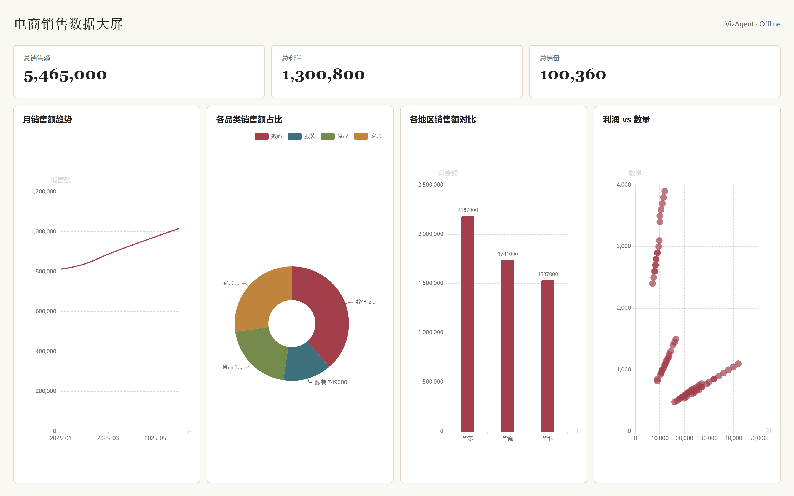
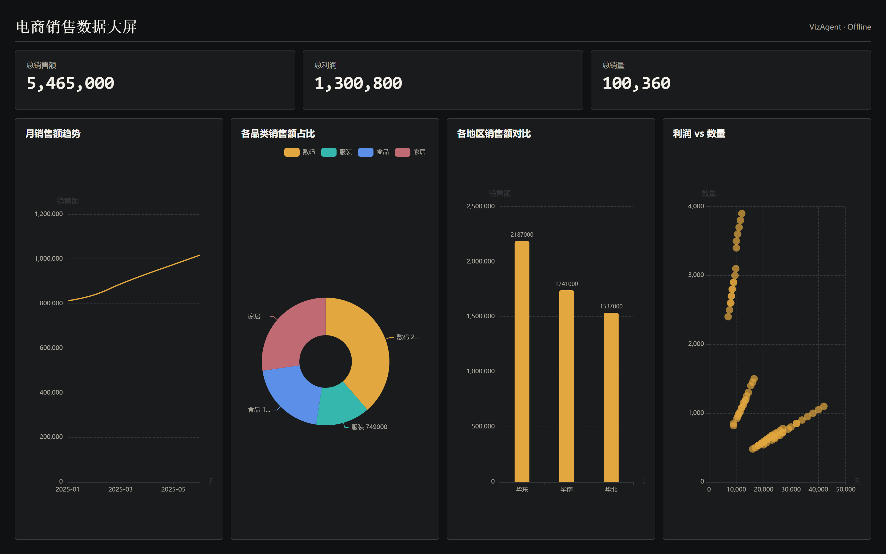

<div align="center">

# ⭐ vizagent-dashboard

**给数据，自动出大屏——一行命令，CSV/Excel 变成可离线打开的 HTML 数据大屏**

[](https://github.com/Carloslee96/vizagent-dashboard/actions/workflows/ci.yml)
[](https://github.com/Carloslee96/vizagent-dashboard/releases)
[](https://pypi.org/project/vizagent-dashboard/)
[](LICENSE)

[](CONTRIBUTING.md)

**中文** · [English](README.en.md)

</div>

<br>

你有一份销售 Excel，老板说「下班前给我个大屏看下趋势」。

```bash
vizagent build --data 销售明细.xlsx
```

30 秒后，一个能直接双击打开的 HTML 大屏躺在 `output/` 里——折线趋势、品类构成、地区地图，全自动生成。不用装数据库，不用配 API Key，不用写代码。

<div align="center">
  
  <br>
  <sub>上图由 <code>vizagent build --data 销售明细.xlsx</code> 自动分析生成，未写任何需求或代码。<br>
  4 个 KPI + 世界地图站点分布 + 8 张图表，全部来自 10 个 Sheet 的自动识别。</sub>
</div>

> 没有数据？仓库自带这份示例，克隆后直接跑：<br>
> `vizagent build --data examples/销售明细.xlsx`

---

## ✨ 它能做什么

- **🧠 自动分析数据**：检测到日期字段出折线趋势、地理字段出地图、占比字段出饼图、分类字段出柱状图。给数据就行，不用写需求。
- **📦 单文件 HTML**：一个自包含文件，ECharts 已内嵌。双击就能看，丢任意静态服务器或发给同事都行，断网也照常渲染。
- **📊 丰富图表**：折线、柱状、饼图、散点、KPI 卡片、中国地图、世界地图。
- **🎨 5 个主题**：`midnight-ops`（默认）、`paper-light`、`warm-editorial`、`clinical-light`、`signal-dark`，一键切换。
- **📁 CSV / Excel 多表**：自动读多个 Sheet，逐表、逐行追踪数据覆盖。
- **✅ 内置质量门禁**：自动查截断、空数据、零尺寸图表、地图未绑定、字段缺失；可选 Playwright 浏览器门禁。
- **🔒 安全默认**：HTML 转义 + Content Security Policy + 路径穿越防护。
- **🤖 可当 Agent Skill**：加载为 Claude Code / Codex 的 Skill，让你自己的 AI 来分析数据、编写更聪明的大屏方案。

---

## 💡 关于「需求」参数——它不是必填

很多人第一反应：「我都给你数据表了，怎么不能自动分析？」

**能。默认就是自动分析。** `--requirement` 是可选的微调，不是必填：

```bash
# ① 自动模式（推荐，最省事）：只给数据，自动分析字段、选图表、配主题
vizagent build --data 销售明细.xlsx

# ② 微调模式：加一句需求，影响图表选择/主题/分页（仍不调 LLM）
vizagent build --data 销售明细.xlsx --requirement "只要饼图，浅色主题，分页展示"

# ③ Spec 模式：完全手动控制，写一份 DashboardSpec JSON，零意外
vizagent build --data 销售明细.xlsx --spec my-spec.json
```

`--requirement` 里写什么会影响结果：

| 写了什么 | 会怎样 |
|---|---|
| `只要饼图` / `仅展示柱状` | 强制用指定图表类型 |
| `浅色` / `明亮` / `纸张` | 切到 paper-light 主题 |
| `分页` / `多页签` | 用 tabs 多页签布局 |
| `地图` | 优先出地图 |
| **不写** | 自动分析，按字段类型选最合适的图表 |

> 想要更智能的分析（比如「对比去年同期」「找出异常点」）？用下面的 **Agent Skill 模式**，让你自己的 AI 来理解需求。

---

## 🚀 30 秒上手

### 1. 安装

```bash
pip install vizagent-dashboard
```

### 2. 准备数据

存成 CSV 或 Excel。多个 Sheet 也行：

```
销售明细.xlsx
├─ 销售趋势   （月份、销售额）        → 自动出折线
├─ 品类构成   （品类、占比）          → 自动出饼图
└─ 地区销售   （省份、销售额）        → 自动出中国地图
```

### 3. 一行命令出大屏

```bash
vizagent build --data 销售明细.xlsx
```

### 4. 打开 `output/output.html`

完事。

---

## 🖼️ 同一份数据，5 个主题

```bash
vizagent build --data 销售明细.xlsx --theme paper-light
```

<div align="center">
  <table>
    <tr>
      <td align="center" width="50%">
        <a href="examples/ecommerce/">
          
          <br><b>midnight-ops</b>（默认）
        </a>
        <br>深靛灰背景、蓝绿数据色
      </td>
      <td align="center" width="50%">
        <a href="examples/ecommerce/">
          
          <br><b>paper-light</b>
        </a>
        <br>暖白纸张、墨色文字
      </td>
    </tr>
    <tr>
      <td align="center" width="50%">
        <a href="examples/ecommerce/">
          
          <br><b>warm-editorial</b>
        </a>
        <br>浅米色、暗红重点
      </td>
      <td align="center" width="50%">
        <a href="examples/ecommerce/">
          
          <br><b>signal-dark</b>
        </a>
        <br>炭黑、琥珀青信号
      </td>
    </tr>
  </table>
</div>

> 第五个主题 `clinical-light` 用 `--theme clinical-light` 自行构建查看。

---

## 📖 命令参数

```bash
vizagent build --data <数据文件> [选项]
```

| 参数 | 默认 | 说明 |
|---|---|---|
| `--data` | 必填 | CSV 或 Excel 文件路径 |
| `--requirement` | 空（自动分析） | 可选微调；写关键词影响图表/主题/分页，不调 LLM |
| `--spec` | 无 | 指定 DashboardSpec JSON，进入完全手动模式 |
| `--theme` | 自动或 `midnight-ops` | 主题 ID，见上表 |
| `--page-mode` | `single_page` | `single_page` 或 `tabs` |
| `--deployment` | `embedded` | `embedded`（离线）或 `cdn` |
| `--output` | `./output` | 输出目录 |
| `--browser` | 关 | 开启 Playwright 浏览器门禁 |
| `--open` | 关 | 成功后自动打开 HTML |

---

## 🤖 Agent Skill 模式（让 AI 帮你分析）

确定性规划器是关键词级别的，懂「日期→折线」但不懂数据背后的业务含义。要更智能的分析，把本项目加载为 **Claude Code / Codex 的 Skill**（位于 `skills/build-data-dashboard/`），让你自己的 AI 来：

1. 读取数据盘点（`vizagent inventory`）
2. 理解你的业务、编写 DashboardSpec
3. 调用 `vizagent compile` 编译、`vizagent validate` 验证

用的是你已有 AI 订阅的推理能力，**不需要额外 API Key**。

```bash
vizagent inventory --data <文件> --output data.inventory.json
vizagent compile  --data <文件> --spec <spec.json> --output dashboard/
vizagent validate --data <文件> --spec <spec.json> --html dashboard/output.html
```

---

## 🏗️ 架构

```
┌──────────────┐    ┌──────────────┐    ┌──────────────┐
│  CSV / XLSX  │───▶│   自动分析   │───▶│    编译器     │───▶ output.html
│  （你的数据） │    │ （选图表）   │    │  （生成 HTML）│
└──────────────┘    └──────────────┘    └──────────────┘
                           │                    │
            --requirement  │                    │
            （可选微调）    ▼                    ▼
                    ┌──────────────┐    ┌──────────────┐
                    │   规划器      │    │   质量门禁    │
                    │ （关键词级）  │    │  （截断/空数据）│
                    └──────────────┘    └──────────────┘
```

**核心设计**：编译器完全确定性，无 LLM、无网络、无 API 调用，输出可复现。`--requirement` 规划器是关键词级的，不是大模型。需要真正的业务理解时，用 Agent Skill 模式让宿主 AI 接管分析。

---

## 🧪 开发

```bash
git clone https://github.com/Carloslee96/vizagent-dashboard.git
cd vizagent-dashboard
pip install -e ".[dev]"
python -m pytest tests/ -v
ruff check src/ tests/
```

---

## 📄 许可证

Apache 2.0 © VizAgent Team。详见 [LICENSE](LICENSE)。

---

<div align="center">
  <b>不用数据库。不用服务器。就一个 HTML 文件。<br>给数据，出大屏。</b>
  <br><br>
  <a href="https://github.com/Carloslee96/vizagent-dashboard/stargazers">
    
  </a>
</div>
