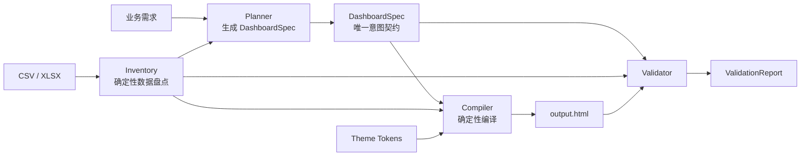

# VizAgent 开源 Skill 方案

> 状态：v2（评审优化稿）
>
> 更新日期：2026-07-26
>
> 目标：把 VizAgent 的大屏生成能力发布为可审计、可安装、可复现的 GitHub 开源项目与 Agent Skill。

---

## 0. 评审结论

### 0.1 总结

原方案的产品方向成立，但技术路径需要调整后再实施。

原方案更接近“从 SaaS 后端复制一份 Python 代码，再包装成 Skill”。主要问题不是功能不足，而是边界与事实来源不清：

- Skill 在 Codex、Claude 等宿主 Agent 内运行时，仍要求用户再配置一套 LLM API Key，形成不必要的“双重模型调用”。
- Python 包、根目录 Skill、主题资产和从 SaaS 复制的代码可能同时成为事实来源，后续容易漂移。
- `SKILL.md` 示例调用了 `scripts/`，但原目录设计没有对应脚本；核心依赖也遗漏了 `layout_planner.py` 等模块。
- “重命名主题”不能解决版权或商标风险，Apache-2.0 也不能在权利清理前直接承诺。
- 缺少输入安全、提示词注入、公式与宏、HTML 注入、路径穿越、密钥泄漏等开源工具必须具备的防线。
- 测试重点偏向“能生成”，尚未覆盖数据完整性、浏览器渲染、布局、地图、跨平台安装和 Skill 触发效果。

### 0.2 最终架构决策

采用“**双模式、单编译内核**”：

1. **Agent Skill 模式（默认）**
   - 由宿主 Agent 理解需求并生成结构化 `DashboardSpec`。
   - 调用本地确定性编译器完成数据读取、布局、图表生成与验证。
   - 不要求第二套 LLM API Key。

2. **独立 CLI / Python 模式（可选）**
   - 用户可直接提供 `DashboardSpec`，全程离线生成。
   - 只有显式启用外部 Planner 时，才调用 OpenAI-compatible Provider。
   - Provider、模型和密钥不进入编译内核。

3. **唯一事实来源**
   - `DashboardSpec` 是大屏意图的唯一机器可读契约。
   - Python 包中的编译器、Schema 和主题是运行时唯一事实来源。
   - Skill 中的脚本只做薄封装，不复制业务实现。

### 0.3 实施建议

结论为：**可以开源，但不要按原方案直接复制代码发布。先完成发布边界与权利审计，再从一个无 LLM 的最小垂直切片开始。**

---

## 1. 产品定位与范围

### 1.1 一句话定位

> 将业务需求与 CSV/XLSX 数据编译为可验证、可离线打开的单文件 HTML 数据大屏。

### 1.2 v0.1 必须支持

- 输入：
  - UTF-8 CSV；
  - `.xlsx` 工作簿；
  - 业务需求文本；
  - 可选的 `DashboardSpec` JSON。
- 输出：
  - 单文件 `output.html`；
  - `dashboard.spec.json`；
  - `data.inventory.json`；
  - `validation.report.json`；
  - `build-manifest.json`。
- 图表：
  - KPI、折线、柱状、饼图、散点、表格；
  - 中国地图、世界地图；
  - 图表过多时支持分页或单页密集布局；
  - 世界地图与中国地图可通过 Tab 切换。
- 质量：
  - 有效数据覆盖可追踪；
  - 浏览器中无 JavaScript 错误；
  - 图表容器非零尺寸；
  - 无明显遮挡、溢出和空白失衡；
  - 相同输入与版本得到语义一致的输出。

### 1.3 v0.1 非目标

- 实时数据库连接；
- 用户登录、团队协作和云端项目管理；
- 定时刷新和流式数据；
- 执行 Excel 宏、外部链接或工作簿脚本；
- 完整复刻 VizAgent SaaS；
- 承诺所有宿主 Agent 都具有完全一致的行为。

`.xls` 可作为后续兼容项，不应为了旧格式扩大 v0.1 的依赖和攻击面。

---

## 2. 总体架构



Planner 有两种实现：

- `HostAgentPlanner`：Skill 默认路径，由当前宿主 Agent 按 Schema 生成 `DashboardSpec`；
- `ExternalLLMPlanner`：CLI 可选扩展，仅在用户显式启用时加载。

Compiler 不感知模型、提示词或 API Key。这样可以独立测试、复现和审计。

### 2.1 核心接口

```python
def inventory(source: Path, policy: InputPolicy) -> DataInventory: ...

def plan(
    requirement: str,
    inventory: DataInventory,
    planner: Planner,
) -> DashboardSpec: ...

def compile_dashboard(
    spec: DashboardSpec,
    inventory: DataInventory,
    theme: Theme,
    output_dir: Path,
) -> BuildManifest: ...

def validate_dashboard(
    html: Path,
    spec: DashboardSpec,
    inventory: DataInventory,
) -> ValidationReport: ...
```

### 2.2 设计约束

- 数据盘点、布局、代码生成和验证必须可在无网络环境执行。
- Planner 只产生意图，不直接拼接最终 HTML。
- 编译器不得根据运行时间、随机数或机器路径产生不可控差异。
- 输出采用临时目录构建，验证通过后再原子替换目标目录。
- 所有降级行为都写入 `BuildManifest`，禁止静默回退。

---

## 3. 核心数据契约

### 3.1 DataInventory

描述输入数据的客观事实，不承载展示意图：

- 文件摘要、工作表、行列数；
- 字段原名、规范化名称、推断类型；
- 空值、唯一值、范围、样例；
- 可识别的时间、地域、指标和维度；
- 公式单元格及缓存值状态；
- 被过滤的无效行列及原因；
- 数据覆盖基线。

### 3.2 DashboardSpec

描述“要生成什么”，是全链路唯一事实来源：

- 标题、说明、语言、主题；
- 页面模式：`single_page` 或 `tabs`；
- 布局网格与响应策略；
- KPI 和图表定义；
- 每个图表的数据源、字段映射、聚合、排序与过滤；
- 地图类型、地域编码策略和 Tab 组合；
- 数据覆盖声明；
- 可访问性与降级规则。

Schema 需要版本号，例如：

```json
{
  "schema_version": "1.0",
  "title": "全球与中国连接分布",
  "page_mode": "single_page",
  "charts": []
}
```

不在 `DashboardSpec` 中保留第二套同义字段。字段迁移通过明确的版本转换器完成。

### 3.3 ValidationReport

验证结果至少包含：

- Schema 合法性；
- 数据覆盖率与未覆盖字段/数据集；
- HTML、CSS、JavaScript 静态检查；
- 浏览器控制台错误；
- 图表实例数量与容器尺寸；
- 空图、缺字段、NaN/Infinity；
- 布局溢出、重叠和视口利用率；
- 地图资源与地域匹配率；
- 严重级别：`error`、`warning`、`info`。

### 3.4 BuildManifest

记录可复现信息：

- VizAgent Skill 版本；
- Schema、编译器和主题版本；
- 输入文件哈希，不记录原始敏感内容；
- 启用的功能与降级项；
- 产物哈希；
- 构建和验证状态。

---

## 4. GitHub 仓库结构

GitHub 项目文档与可安装 Skill 必须分层，避免把面向贡献者的资料全部加载进 Agent 上下文。

```text
vizagent-dashboard/
├── README.md
├── LICENSE                     # 权利审计通过后确定
├── NOTICE
├── SECURITY.md
├── CONTRIBUTING.md
├── CODE_OF_CONDUCT.md
├── pyproject.toml
├── src/
│   └── vizagent_dashboard/
│       ├── cli.py
│       ├── inventory/
│       ├── schemas/
│       │   └── dashboard-spec.schema.json
│       ├── planner/
│       │   ├── protocol.py
│       │   └── external_llm.py
│       ├── compiler/
│       ├── validation/
│       └── themes/
├── skills/
│   └── build-data-dashboard/
│       ├── SKILL.md
│       ├── agents/
│       │   └── openai.yaml
│       ├── scripts/
│       │   ├── inspect_data.py
│       │   ├── compile_dashboard.py
│       │   └── validate_dashboard.py
│       └── references/
│           ├── dashboard-spec.md
│           ├── workflow.md
│           ├── quality-gates.md
│           └── troubleshooting.md
├── tests/
│   ├── unit/
│   ├── contract/
│   ├── browser/
│   ├── security/
│   └── fixtures/
├── examples/
│   ├── connectivity/
│   ├── ecommerce/
│   └── operations/
├── tools/
│   ├── import_from_vizagent.py
│   └── upstream-manifest.toml
├── docs/
│   ├── architecture.md
│   ├── provider-guide.md
│   ├── launch-plan.md
│   └── release-process.md
└── .github/
    └── workflows/
        ├── ci.yml
        ├── security.yml
        └── release.yml
```

约束：

- `src/vizagent_dashboard/` 是实现、Schema 和运行时主题的唯一来源。
- `skills/build-data-dashboard/scripts/` 只调用已安装的包，不复制编译逻辑。
- Skill 内不放 README、CHANGELOG、开发历史或营销材料。
- Skill 的 `references/` 保持一层深度；`SKILL.md` 直接链接每个参考文件。
- 示例数据全部合成，生成产物由 CI 重建，不把大体积 HTML 当作源代码维护。

建议按能力拆分依赖：

- `pip install vizagent-dashboard`：数据盘点、Schema、编译和静态验证；
- `pip install "vizagent-dashboard[browser]"`：增加 Playwright 浏览器质量验证；
- `pip install "vizagent-dashboard[llm]"`：增加可选外部 Planner；
- `pip install "vizagent-dashboard[all]"`：完整本地能力。

Agent Skill 的安装说明默认使用 `browser` 能力；没有浏览器时只能给出“静态验证通过”，不得宣称完整质量门禁已通过。

---

## 5. Skill 设计

### 5.1 命名

- Skill 目录和 `name`：`build-data-dashboard`
- 产品展示名：`VizAgent Dashboard Builder`
- Python 包：`vizagent-dashboard`

Skill 名称采用动词开头，表达它要完成的任务，而不是只表达项目品牌。

### 5.2 Frontmatter

`SKILL.md` 的 frontmatter 只保留 `name` 和 `description`：

```yaml
---
name: build-data-dashboard
description: >-
  Build and validate standalone HTML data dashboards from business requirements
  and CSV/XLSX data. Use when the user asks to create, regenerate, inspect, or
  validate a data dashboard, operations screen, monitoring wall, KPI board, or
  ECharts-based visualization. Produces a structured DashboardSpec and a
  browser-ready HTML artifact; use the host-agent workflow by default and the
  optional external-LLM planner only when explicitly requested.
---
```

描述同时承担“能力说明”和“触发条件”，正文不再重复一节“When to use”。

### 5.3 SKILL.md 正文结构

正文控制在 500 行以内，使用祈使句，只保留执行必需信息：

1. 默认工作流；
2. 输入检查与安全边界；
3. 生成 `DataInventory`；
4. 按 Schema 创建或修订 `DashboardSpec`；
5. 编译并验证；
6. 验证失败时的有限重试；
7. 交付产物与报告；
8. 按条件读取参考文件。

建议路由：

- 创建或修改 Spec 时读取 `references/dashboard-spec.md`；
- 选择分页、单页、地图布局时读取 `references/workflow.md`；
- 验收和失败重试时读取 `references/quality-gates.md`；
- 仅在报错时读取 `references/troubleshooting.md`。

### 5.4 Agent 工作流

1. 检查输入类型、大小、工作表和输出路径。
2. 运行 `inspect_data.py` 生成 `DataInventory`。
3. 宿主 Agent 将需求与 Inventory 转换为合法 `DashboardSpec`。
4. 运行 `compile_dashboard.py`。
5. 运行 `validate_dashboard.py`。
6. 对 Spec 最多修订两轮；不得通过隐藏数据或删除失败图表来获得通过。
7. 返回 HTML、Spec、验证报告和关键告警。

用户只要求分析或审查时，不生成或覆盖大屏文件。

### 5.5 openai.yaml

使用 Skill 脚手架工具生成 `agents/openai.yaml`，至少提供：

- 面向用户的 `display_name`；
- 简短 `short_description`；
- 与 `SKILL.md` 一致的 `default_prompt`；
- 可选的品牌图标，不在配置中写运行逻辑。

实际创建 Skill 时使用 `skill-creator` 提供的 `init_skill.py`，完成后运行 `quick_validate.py`。

---

## 6. CLI 与 Python API

### 6.1 CLI

```bash
# 数据盘点，不调用模型
vizagent inventory sales.xlsx --output build/data.inventory.json

# 使用已有 Spec 编译，不调用模型
vizagent compile \
  --data sales.xlsx \
  --spec dashboard.spec.json \
  --output build/

# 验证已有产物
vizagent validate \
  --data sales.xlsx \
  --spec dashboard.spec.json \
  --html build/output.html

# 可选：调用显式配置的外部 Planner
vizagent plan \
  --data sales.xlsx \
  --requirement requirement.md \
  --planner openai-compatible \
  --output dashboard.spec.json

# 组合命令；只有指定 --planner 时才允许联网
vizagent generate \
  --data sales.xlsx \
  --requirement requirement.md \
  --planner openai-compatible \
  --output build/
```

建议退出码：

| 退出码 | 含义 |
|---|---|
| `0` | 成功，验证通过 |
| `2` | 输入或 Schema 错误 |
| `3` | 编译失败 |
| `4` | 编译成功但质量门禁未通过 |
| `5` | 外部 Planner 或网络失败 |

### 6.2 Python API

Python API 只暴露稳定契约，内部布局和渲染实现不作为公共 API：

```python
from vizagent_dashboard import inventory, compile_dashboard, validate_dashboard
```

采用语义化版本：

- Schema 的破坏性变更提升 Schema major；
- 公共 Python API 的破坏性变更提升包 major；
- 主题视觉调整不应悄悄改变已有构建，必须通过主题版本锁定。

---

## 7. 外部 Planner、密钥与隐私

### 7.1 Provider 边界

定义最小协议，不把任一厂商 SDK 类型泄漏到核心：

```python
class Planner(Protocol):
    def create_spec(
        self,
        requirement: str,
        inventory: DataInventory,
        schema: dict,
    ) -> DashboardSpec: ...
```

Provider Adapter 负责：

- 模型名与 Endpoint；
- 结构化输出或工具调用差异；
- 超时、重试、限流和 token 预算；
- 错误归一化；
- 能力探测。

不要把易变化的具体模型名写成长期默认值。用户显式传入，或由独立的 Provider 配置选择。

### 7.2 密钥管理

- 禁止在命令行参数中传递 API Key，避免进入 Shell 历史和进程列表。
- 配置文件只保存 Endpoint、模型和非敏感选项。
- 密钥只从环境变量、操作系统 Keyring 或交互式安全输入读取。
- 日志、异常、遥测和 `BuildManifest` 必须脱敏。
- 示例、测试夹具和录屏不得包含真实密钥。

### 7.3 数据隐私

- 默认编译路径不把 Excel 内容发送到额外服务。
- 使用外部 Planner 前明确提示：发送的字段名、摘要或样例可能离开本机。
- 提供“仅发送 Schema 摘要”和“允许发送样例”的独立策略。
- 支持完全离线编译；是否与宿主 Agent 共享数据由宿主平台本身的权限和政策决定，不作越界承诺。

---

## 8. 安全模型

所有需求文本、文件名、Sheet 名、单元格、公式缓存值和外部模型输出都视为不可信输入。

### 8.1 输入防线

- 仅接受白名单格式；
- 限制压缩包展开大小、文件大小、Sheet 数、行列数和单元格长度；
- 不执行 VBA、宏、公式、外部链接、DDE 或嵌入对象；
- 公式仅读取已缓存结果，并在缺少缓存时报告；
- 防止 ZIP bomb 和路径穿越；
- 将单元格中的“指令”按数据处理，不能覆盖 Skill 工作流。

### 8.2 输出防线

- HTML 文本、属性和 JSON 上下文分别转义；
- 防止 `</script>` 提前闭合和模板注入；
- 默认生成严格 CSP；
- 外部 CDN 资源必须固定版本并可切换为本地资产；
- 输出目录执行规范化和边界检查；
- 不覆盖输入文件或目标目录外文件。

### 8.3 网络与依赖

- 编译器默认不联网；
- 外部 Planner 使用协议和主机白名单、超时与有限重试；
- CI 执行依赖审计、许可证扫描和 SBOM 生成；
- 发布包使用锁定依赖、哈希和可验证的 GitHub Actions 流程。

---

## 9. 从 SaaS 提取代码的策略

### 9.1 不采用自由手工复制

原方案的“复制约 3,500 行并在文件头记录 commit”只能说明来源，不能防止实现漂移，也无法证明哪些修改需要同步。

建议分两阶段：

1. **一次性提取**
   - 先画出模块依赖图；
   - 从最小垂直切片提取纯函数；
   - 移除 LangGraph、FastAPI、数据库和项目目录依赖；
   - 为每个提取模块记录来源 commit、文件、范围、重写方式和权利状态；
   - 先通过等价测试，再进入开源仓库。

2. **明确权威方向**
   - v0.1 阶段 SaaS 不改动，开源编译器独立演进；
   - 后续若 SaaS 复用开源内核，另立迁移项目完成全链路切换；
   - 不长期维护“双方都能改、偶尔手工同步”的双主模式。

### 9.2 必须同步上游时

若发布前确实需要多次从私有仓库导入：

- 使用 `tools/import_from_vizagent.py`；
- 在 `upstream-manifest.toml` 固定来源 commit 与文件哈希；
- 导入后应用可审计的 patch；
- CI 检查语义差异、许可证和完整测试；
- 禁止复制私有配置、日志、提示词实验、客户数据和生成项目。

### 9.3 第一批提取范围

不要按文件名直接搬运，按职责重新切分：

- Schema 与字段类型；
- 数据盘点；
- 布局规划；
- 图表注册与 option 生成；
- KPI 生成；
- 主题解析；
- HTML 编译；
- 质量验证。

现有 `skeleton.py` 职责过多，应在开源边界内拆分，而不是整体复制后再继续叠加。

---

## 10. 主题、品牌与许可证

### 10.1 主题策略

“修改 Palantir、Claude、Vercel 等主题名称”不是充分的法律处理。

v0.1 使用重新设计的通用主题：

- `midnight-ops`
- `paper-brief`
- `warm-editorial`
- `clinical-light`
- `signal-dark`

要求：

- 从通用设计 token 和明确需求重新创作；
- 不复刻特定品牌的名称、Logo、专有文案和高度可识别资产；
- 保留主题来源与作者记录；
- 地图数据和字体单独核验许可证。

### 10.2 发布权利门禁

Apache-2.0 是候选许可证，不是当前既成结论。公开前必须完成：

- 代码作者与雇佣/委托权属确认；
- 第三方源码和依赖许可证清单；
- 字体、图标、地图 GeoJSON、截图和示例数据权利确认；
- 私有提示词、客户数据、内部 URL、Token、日志和构建产物扫描；
- `LICENSE`、`NOTICE`、SBOM 与第三方声明一致。

任何来源不清的文件都不得进入首个公开 commit。

---

## 11. 测试与发布门禁

### 11.1 测试金字塔

1. **单元测试**
   - 类型推断、字段规范化、聚合、主题解析、布局算法和转义。
2. **契约测试**
   - `DashboardSpec` JSON Schema；
   - Schema 版本迁移；
   - CLI 退出码和产物清单。
3. **语义快照**
   - DOM 结构、图表类型、字段映射和数据覆盖；
   - 避免对无关空格或构建时间做脆弱快照。
4. **浏览器测试**
   - Playwright 打开输出；
   - 控制台零错误；
   - ECharts 实例与容器非空；
   - 关键视口无重叠、截断和异常滚动；
   - 地图轮廓、区域色差、Tab 切换正常。
5. **安全测试**
   - 恶意单元格、HTML/脚本注入、Prompt Injection；
   - ZIP bomb、路径穿越、超大文件；
   - 密钥与隐私信息脱敏。
6. **Skill 前向测试**
   - 在干净上下文中验证触发、输入检查、Spec 质量和失败恢复；
   - Codex 与 Claude 分别保留代表性样例；
   - 测试问题通过改进 Skill、Schema 或工具解决，不针对个别样例写特判。

### 11.2 CI 矩阵

- 操作系统：Ubuntu、Windows、macOS；
- Python：先根据依赖审计确定支持范围，建议从 3.10–3.12 起步；
- 构建：wheel 和 sdist 均执行干净环境安装；
- 浏览器：至少 Chromium；
- 工具：lint、类型检查、单元测试、浏览器测试、依赖审计、许可证扫描。

### 11.3 v0.1 发布门禁

- 所有权利审计项通过；
- 干净环境可安装；
- 三个示例均可从源数据重新生成；
- 数据覆盖率达到各示例声明的 100%；
- 浏览器无 error 级问题；
- Skill 校验与跨宿主前向测试通过；
- 不需要外部 Key 的默认路径完整可用；
- 安全扫描无未处置的高危项。

---

## 12. 示例与演示

保留三个互补示例：

| 示例 | 重点验证 |
|---|---|
| 全球连接分布 | 世界/中国地图、Tab、地域匹配、地图大容器 |
| 电商经营分析 | 多 Sheet、多序列、趋势、排行、单页密集布局 |
| 运营健康监控 | KPI、异常状态、表格、深浅主题 |

规则：

- 数据完全合成并附生成脚本；
- 需求、Spec、截图和验证报告一起展示；
- README 只放优化后的静态图或短 GIF；
- 可交互 HTML 发布到 GitHub Pages 或 Release，不把生成文件当作手写源文件；
- 示例重点展示“输入 → Spec → HTML → 验证”，而不是只展示最终截图。

---

## 13. 里程碑

### G0：发布边界与权利清理

- 确定仓库名称、归属和候选许可证；
- 完成源码、主题、地图、字体、示例数据审计；
- 建立 provenance 清单；
- 明确 v0.1 范围与非目标。

**出口条件：** 所有拟公开资产都有明确来源和处理结论。

### G1：无 LLM 最小垂直切片

- 建立包结构和 `DashboardSpec`；
- 实现 CSV Inventory；
- 支持一个 KPI、一个基础图表和一个主题；
- 编译单文件 HTML；
- 生成机器可读验证报告。

**出口条件：** `spec + csv → html` 在三系统可复现。

### G2：完整编译与质量闭环

- XLSX、多 Sheet、布局、地图、分页/单页；
- 主题系统和资源离线化；
- 浏览器质量检测；
- 安全测试和构建清单。

**出口条件：** 三个代表性示例通过硬性门禁。

### G3：可安装 Agent Skill

- 用脚手架创建 `skills/build-data-dashboard`；
- 完成渐进式引用和薄脚本；
- 生成 `agents/openai.yaml`；
- 完成 Skill 校验与跨宿主前向测试。

**出口条件：** 宿主 Agent 无额外 API Key 完成生成与验证。

### G4：可选外部 Planner

- 定义 Planner Protocol；
- 实现第一个 OpenAI-compatible Adapter；
- 加入隐私提示、脱敏和失败降级；
- 验证结构化输出稳定性。

**出口条件：** Planner 可完全卸载，且不影响编译核心。

### G5：开源发布

- README、架构、安全、贡献和发布文档；
- wheel/sdist、SBOM、签名或 provenance；
- GitHub Pages 示例；
- `v0.1.0` Release。

**出口条件：** 新用户按 README 可在干净环境复现示例。

不以“十天”作为架构承诺。时间估算应在 G0 依赖图和权利审计完成后单独制定。

---

## 14. 开源发布策略

首发重点不是追求一个固定 Star 数，而是建立可信证据：

- 30 秒看懂：首屏 GIF 展示从 Excel 到大屏；
- 3 分钟跑通：一个无 Key 的最小命令；
- 可审计：公开 Spec、验证报告、CI 和安全边界；
- 可扩展：提供自定义主题和图表插件的稳定接口；
- 可贡献：Issue 模板、开发环境、测试命令和小型首要任务清晰。

发布渠道与增长计划放在独立的 `docs/launch-plan.md`，不与核心架构和质量门禁混在一起。

---

## 15. 最终决策与待确认项

### 已决策

| 事项 | 决策 |
|---|---|
| 产品形态 | GitHub 项目 + Python CLI/包 + 可安装 Agent Skill |
| 核心架构 | 双模式、单编译内核 |
| 默认模型调用 | 使用宿主 Agent，不要求额外 Key |
| 外部 LLM | 可选 Planner，不进入编译核心 |
| 意图 SSOT | 版本化 `DashboardSpec` |
| 代码 SSOT | `src/vizagent_dashboard/` |
| Skill 实现 | 薄脚本 + 渐进式 references |
| 同步方式 | 一次性提取；必要同步必须脚本化和可审计 |
| 默认网络 | 编译器离线，只有显式 Planner 可联网 |
| 示例数据 | 全部合成 |
| 版本策略 | Schema 与包分别语义化版本 |

### G0 必须确认

| 事项 | 当前建议 |
|---|---|
| GitHub 仓库名 | `vizagent-dashboard` |
| Skill 名 | `build-data-dashboard` |
| PyPI 名 | 发布前检查可用性与名称冲突 |
| 许可证 | Apache-2.0 候选，权利审计后确认 |
| Python 范围 | 先支持 3.10–3.12，再按 CI 扩展 |
| 地图资产 | 选择许可清晰、可再分发的数据源 |
| SaaS 反向复用 | 不属于 v0.1，另立迁移计划 |

---

## 16. 下一步

第一轮实施只做 G0 和 G1，不先写完整 Planner：

1. 建立代码与资产 provenance 清单；
2. 梳理 `skeleton.py`、`layout_planner.py`、`chart_options.py`、`kpi_options.py`、`design_loader.py` 的依赖图；
3. 定义 `DataInventory`、`DashboardSpec`、`ValidationReport`；
4. 用脚手架建立新仓库骨架；
5. 打通一个完全离线、无 LLM 的 `CSV + Spec → HTML → Report` 垂直切片；
6. 通过门禁后，再扩展 XLSX、地图和 Agent Skill。

这条路径先证明“编译与验证可靠”，再增加模型规划能力，能够最大限度降低开源后的不可复现、密钥门槛和维护漂移。
