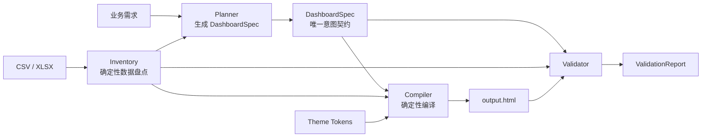

# VizAgent Dashboard — 开源 Skill 最终实施方案

> 状态：**v3 最终确认稿** | 更新日期：2026-07-26
>
> 目标：把 VizAgent 的大屏生成能力发布为可审计、可安装、可复现的 GitHub 开源项目与 Agent Skill，**在不影响原 SaaS 项目的前提下，以最大化 GitHub Stars 为原则**。

---

## 0. TL;DR（30 秒决定要不要往下读）

| 项 | 内容 |
|---|---|
| 产品 | 一行命令把 Excel/CSV + 业务需求变成单文件 HTML 大屏 |
| 亮点 | **用你自己的 AI 订阅**，**20+ 预置主题**，不需要数据库，不需要服务器，不需要联网 |
| 仓库 | `github.com/{你}/vizagent-dashboard` |
| 目录 | **本仓库下的 `skill/` 目录**（与 SaaS 主项目完全物理隔离） |
| 架构 | **双模式单编译内核**：Agent Skill（宿主 LLM） + CLI（离线） |
| 许可证 | Apache 2.0 |
| 首发目标 | **4 周**出 v0.1.0 |
| Star 策略 | README 第一屏 GIF + 零摩擦上手 + SEO 关键词全打 + 首发多渠道分发 |

---

## 1. 核心约束（不可违背）

```
┌─────────────────────────────────────────────────────────┐
│             本仓库 D:\AIIIIIIIIIIIIII\vizagent            │
├──────────────────┬──────────────────────────────────────┤
│  SaaS 主项目      │  开源 Skill                          │
│  app/             │  skill/                              │
│  viz-agent-team/  │    ├─ README.md                     │
│  CLAUDE.md        │    ├─ src/vizagent_dashboard/       │
│  CHANGELOG.md     │    ├─ SKILL.md                      │
│  CODEX_*.md       │    ├─ examples/                     │
│                   │    ├─ tests/                        │
│                   │    └─ docs/                         │
├──────────────────┼──────────────────────────────────────┤
│  继续迭代        │  独立演进，不碰 SaaS 一行代码          │
│  不动 skill/     │  只读 SaaS 代码做一次性提取            │
└──────────────────┴──────────────────────────────────────┘
```

**红线**：
- ✅ `skill/` 目录完全独立，SaaS 一行代码不动
- ✅ SaaS 后续迭代不影响 `skill/`
- ✅ skill 后续迭代不修改 `viz-agent-team/` 或 `app/`
- ✅ 代码从 SaaS 做**一次性提取**，带来源 commit 注释；不手工同步
- ✅ SaaS 自己的 `CHANGELOG.md`、`CLAUDE.md`、`CODEX_*.md` 全部不进入 skill

---

## 2. 架构：双模式、单编译内核



### 两种模式

| 模式 | 调用方 | Planner | LLM 算力由谁承担 |
|---|---|---|---|
| **Agent Skill（默认）** | Claude / Codex / 任意 AI | 宿主 Agent 按 Schema 生成 DashboardSpec | **用户自己的 AI 订阅**（宿主推理，无需额外配 Key） |
| **CLI — Spec 模式** | 终端 / CI / 二次开发 | 用户直接写 DashboardSpec | **无需 LLM**（编译器确定性编译，零 API 调用） |
| **CLI — Planner 模式** | 终端 / CI | 外部 LLM（openai-compatible） | **用户自配 Key**（`vizagent config --set api_key=...`） |

### 核心接口

```python
def inventory(source: Path, policy: InputPolicy) -> DataInventory: ...
def plan(requirement: str, inventory: DataInventory, planner: Planner) -> DashboardSpec: ...
def compile_dashboard(spec: DashboardSpec, inventory: DataInventory, theme: Theme, output_dir: Path) -> BuildManifest: ...
def validate_dashboard(html: Path, spec: DashboardSpec, inventory: DataInventory) -> ValidationReport: ...
```

**关键规则**：Compiler 不感知模型、提示词或 API Key。Planner 只产生意图契约，不直接拼接 HTML。

---

## 3. 仓库结构

```
skill/
├── README.md              # ⭐ Star 决策的第一触点
├── LICENSE                # Apache 2.0
├── SKILL.md               # Anthropic Skills 格式（AI 可加载）
├── pyproject.toml          # pip install vizagent-dashboard
├── .gitignore
│
├── src/vizagent_dashboard/ # ⭐ 唯一事实来源
│   ├── __init__.py
│   ├── cli.py             # CLI 入口
│   ├── inventory/         # 数据盘点
│   │   ├── reader.py      # CSV / XLSX 读取
│   │   └── spec.py        # DataInventory 定义
│   ├── schemas/
│   │   └── dashboard_spec.py  # DashboardSpec Pydantic
│   ├── compiler/          # 确定性编译
│   │   ├── layout.py      # 布局规划
│   │   ├── chart_options.py  # 图表 option 生成
│   │   ├── kpi_options.py    # KPI 数值格式
│   │   ├── skeleton.py    # HTML 骨架
│   │   └── themes.py      # 主题解析
│   ├── validation/        # 质量门禁
│   │   ├── static.py      # 静态检查（截断/覆盖/溢出）
│   │   └── browser.py     # 浏览器检查（Playwright，可选）
│   └── assets/            # 主题 md + GeoJSON 引用（20+ 主题去品牌命名）
│       ├── paper-linen.md        # 暖纸衬线人文风
│       ├── minimal-doc.md        # 温暖纸感文档风
│       ├── command-post.md       # 冷峻指挥中心风
│       ├── fitness-glass.md      # 健康玻璃环风
│       ├── warm-editorial.md     # 暖色调新闻室风
│       ├── monitor-dark.md       # 暗色运维监控风
│       ├── cozy-retreat.md       # 温暖舒适旅行风
│       ├── clean-slate.md        # 简洁亮色科技风
│       ├── design-toolkit.md     # 设计师工具风
│       ├── vibe-night.md         # 音乐暗色律动风
│       ├── crypto-sleek.md       # 深色金融科技风
│       ├── checkout-light.md     # 亮色支付简洁风
│       ├── minimal-tracker.md    # 极简项目管理风
│       ├── ocean-night.md        # 深海暗色风
│       ├── error-monitor.md      # 错误监控暗色风
│       ├── growth-analytics.md   # 产品数据分析风
│       ├── deal-room.md          # 金融暗色交易风
│       ├── open-table.md         # 开源数据暗色风
│       ├── amber-console.md      # 琥珀色复古终端风
│       └── deploy-light.md       # 亮色部署极简风
│
├── tools/
│   ├── import_from_vizagent.py   # 一次性提取 SaaS 核心代码
│   └── upstream-manifest.toml    # 来源 commit + 哈希锁定
│
├── examples/              # ⭐ 三个展示示例
│   ├── ecommerce/         # 电商经营分析（主推）
│   ├── connectivity/      # 全球连接分布
│   └── operations/        # 运营健康监控
│
├── tests/                 # 测试金字塔
│   ├── unit/
│   ├── contract/
│   ├── browser/           # Playwright（可选依赖）
│   └── fixtures/
│
├── docs/
│   ├── architecture.md
│   └── launch-plan.md     # 发布策略（HN/Reddit/渠道）
│
├── CHANGELOG.md           # skill 独立版本日志
│
└── .github/workflows/
    ├── ci.yml             # lint + test + build
    ├── security.yml       # 依赖审计 + 密钥扫描
    └── release.yml        # PyPI 发布 + GitHub Releases
```

---

## 4. ⭐ Star 增长策略（最高优先级）

### 4.1 README 结构（决定 80% 的 star）

**第一屏（用户无滚动即时决策）**：
```
┌─────────────────────────────────────────────────────┐
│ ⭐ vizagent-dashboard                                │
│ Turn business requirements into HTML dashboards     │
│           — Use your own AI —           │
│                                                     │
│ [CI] [License] [PyPI] [Python 3.10-3.12]            │
│                                                     │
│ ┌─────────────────────────────────────┐             │
│ │        30s DEMO GIF                 │  ← ⭐ 核心    │
│ │  pip install → 一行命令 → 出大屏       │             │
│ └─────────────────────────────────────┘             │
│                                                     │
│ pip install vizagent-dashboard                      │
│ vizagent build --data data.xlsx --output dashboard/ │
│                                                     │
│ No database. No server. Just one HTML file.                 │
│ Just one HTML file.                                 │
└─────────────────────────────────────────────────────┘
```

**第二屏**：主题画廊墙（20+ 主题缩略图矩阵）
**第三屏**：3 个示例缩略图 + 一句话说明
**第四屏**：安装 → 快速开始（5 行命令）
**第三屏**：安装 → 快速开始（5 行命令）
**后续**：Features / Architecture / Contributing / License

### 4.2 SEO 关键词

**GitHub Topics**：
```
dashboard, data-visualization, echarts, ai, llm,
agent-skill, claude-code, data-analysis, business-intelligence,
python, csv, xlsx, html-report, monitoring
```

**README 关键词自然嵌入**：
- "Turn business requirements into HTML dashboards"
- "Use your own AI — no hidden API bills"
- "Build and validate standalone HTML data dashboards"
- "Works with or without an LLM"

### 4.3 首发渠道爆发（Week 4）

| 渠道 | 时机 | 内容重点 |
|---|---|---|
| **Hacker News** (Show HN) | 发布当天 9:00 ET | GIF + "Use your own AI" 钩子 |
| **Reddit** r/MachineLearning + r/Python + r/dataisbeautiful | 发布当天 | 技术实现 + 演示效果 |
| **V2EX** | 发布当天 | 中文版：一行命令出大屏 |
| **掘金** | 发布当天 | 中文技术教程：原理 + 源码 |
| **Twitter/X** #buildinpublic | 持续每周 | 开发进度 + 截图 |
| **Awesome 列表 PR** | 发布后 1 周 | awesome-llm, awesome-data-viz, awesome-python |
| **Product Hunt** | v0.2 稳定后 | — |

### 4.4 DEMO GIF（⭐ 最重要）

5 秒 GIF 包含的叙事链：
```
1. 终端输入  vizagent build --data sales.xlsx --requirement "每月销售额趋势"
2. 终端输出  ✓ Dashboard generated in 3.2s
3. 浏览器打开 → 展示一个酷炫大屏（深色主题 + 地图 + 折线 + KPI）
4. Build complete 徽章
```

录制工具：Playwright（`tests/browser/` 已集成）→ ffmpeg 转 GIF。

### 4.5 主题画廊（⭐ 第二屏吸睛利器）

**20+ 预置主题矩阵**，每种截图做成缩略图，平铺在 README 第二屏：

| 主题名 | 风格 | 来源灵感 |
|--------|------|---------|
| `paper-linen` | 暖纸衬线人文风 | 暖色纸面 + 陶土橙 + 衬线字 |
| `minimal-doc` | 温暖纸感文档风 | 浅色、纸感、反科技感 |
| `command-post` | 冷峻指挥中心风 | 近黑背景 + 单色蓝阶 |
| `fitness-glass` | 健康玻璃环风 | 毛玻璃 + 身份色环 |
| `warm-editorial` | 暖色调新闻室风 | 新闻室暖色编辑风 |
| `monitor-dark` | 暗色运维监控风 | Grafana 风格暗色运维 |
| `cozy-retreat` | 温暖舒适旅行风 | Airbnb 暖棕色系 |
| `clean-slate` | 简洁亮色科技风 | Apple 简洁亮色风 |
| `design-toolkit` | 设计师工具风 | Figma 灵感设计工具风 |
| `vibe-night` | 音乐暗色律动风 | Spotify 暗色音乐风 |
| ...另有 10 个主题省略 |

**对 Star 的价值**：主题墙在 README 第二屏形成视觉冲击——用户滚动到这里看到 20+ 风格各异的大屏截图，直接产生"想试试"的冲动。这是决定 star 的第二关键触点（第一是 GIF）。

主题数量本身也是 SEO 关键词（"20+ built-in themes"）。

---

## 5. 里程碑（4 周硬线）

### G0+G1 合并：MVP 即发布（Week 1-2）

> 产出：一个能跑、能秀、能 star 的最小完整发布

| 任务 | 产出 | 是否影响 SaaS |
|---|---|---|
| 权利快速扫描 | 清理所有来源不清的文件 | ❌ |
| 包骨架 | pyproject.toml / CLI 入口 / CI | ❌ |
| **README v1 + DEMO GIF** | 第一屏到位 | ❌ |
| CSV + XLSX Inventory | 数据盘点 | ❌（从 SaaS 一次性提取） |
| 编译：KPI + 折线/柱状/饼图 | 首批图表 | ❌（同上） |
| 编译：中国地图 | 地图支持 | ❌（同上） |
| 验证：静态检查 | 截断 / 覆盖 / 溢出 | ❌（同上） |
| **示例 1：电商经营分析** | 完整的酷炫 Demo | ❌（合成数据） |
| 安全：HTML 转义 + CSP + 路径穿越 | 首发两层硬线 | ❌ |
| 浏览器：Playwright 检查 | 零 JS 错误 + 图表非零 | ❌ |

**出口条件**：
- `pip install vizagent-dashboard && vizagent build --data examples/ecommerce/data.xlsx --output /tmp/build` 可复现
- 产出的 HTML 浏览器打开无 JS 错误，6+ 图表正常渲染
- README 第一屏到位，GIF 可播放

### G2+G3：Skill 完整（Week 3）

| 任务 | 产出 |
|---|---|
| SKILL.md 完整 | Claude / Codex 可直接加载 |
| 三套主题 | midnight-ops / paper-brief / warm-editorial |
| 多 sheet / 分页 / 世界地图 Tab | 完整布局能力 |
| **GitHub Pages demo 站** | 可交互大屏 HTML 在线展示 |
| 浏览器质量门禁（Playwright） | overlaps / zero-size / maps 检查 |

### G4+G5：开源发布（Week 4）

| 任务 | 产出 |
|---|---|
| 外部 Planner（openai-compatible） | 用户自配 Key 可选增强 |
| LICENSE / CONTRIBUTING / SECURITY 全套 | 规范 |
| **多渠道发布** | HN / Reddit / V2EX / 掘金 |
| Awesome-* 列表 PR | awesome-llm / awesome-python |
| Tag v0.1.0 + Release Notes | GitHub Releases |
| GitHub Pages demo 补充 | 全示例上线 |

---

## 6. 代码提取策略（确保 SaaS 不受影响）

### 6.1 一次性提取流程

```
SaaS 代码 (viz-agent-team/backend/agents/)
  │ read-only
  ▼
tools/import_from_vizagent.py   ← 提取脚本（在 skill/ 内运行）
  │ 1. 按 manifest 读 SaaS 文件
  │ 2. 剥离 LangGraph / FastAPI / DB 依赖
  │ 3. 改写为函数式接口
  │ 4. 写入 skill/src/vizagent_dashboard/
  ▼
tools/upstream-manifest.toml
  ├─ [skeleton.py]  commit = "23f4ffe"  path = "agents/skeleton.py"
  ├─ [chart_options.py]  commit = "23f4ffe"  path = "agents/chart_options.py"
  └─ ...
  │ 每次提取更新 manifest + 哈希
  ▼
后续：v0.1 阶段 SaaS 不改动，开源编译器独立演进
      若 SaaS 反向复用内核，另立迁移项目
      不长期维护"双方可改、手工同步"的双主模式
```

### 6.2 提取清单

| SaaS 模块 | 目标路径 | 需改动 |
|---|---|---|
| `agents/skeleton.py` | `compiler/skeleton.py` | 去 FlowState/LLMClient 依赖，函数式 |
| `agents/chart_options.py` | `compiler/chart_options.py` | 去 LLMClient → 改成数据驱动 |
| `agents/kpi_options.py` | `compiler/kpi_options.py` | 去 LLMClient |
| `agents/quality.py` | `validation/` | 只取 check_* 函数 |
| `agents/schemas.py` | `schemas/` | 纯 Pydantic 几乎不变 |
| `agents/design_loader.py` | `compiler/themes.py` | 去 LangChain 消息依赖 |
| `agents/chart_registry.py` | `compiler/` | 纯数据，几乎不变 |
| `agents/design-systems/*.md` | `assets/` | **重命名** midnight-ops 等 |
| `agents/graph.py` | ❌ | LangGraph 编排，不迁移 |
| `agents/browser_test.py` | `validation/browser.py` | 精简版（Playwright 可选） |
| `routers/*` / `services/*` / `deps/*` / `main.py` | ❌ | Web 层，不迁移 |

---

## 7. 安全模型（⭐ 首发只做两层硬性，其余延后）

| 层 | 首发必做 | 延后 |
|---|---|---|
| HTML 输出转义 + 严格 CSP | ✅ | |
| 路径穿越防护（输出目录规范化） | ✅ | |
| 输入文件大小 / Sheet 数 / 行列数限制 | ✅ | |
| ZIP bomb 防御 | | ✅ v0.2 |
| Prompt Injection 防御 | | ✅ v0.2 |
| 依赖审计 + SBOM | | ✅ v0.2 |
| Provider 白名单 | | ✅ v0.2 |
| GitHub secret scanning | ✅（社区免费） | |

---

## 8. 许可证与权利

### 许可证

**Apache 2.0**（首发即确定）—— 专利授权 + 企业友好。

### 权利清理（快速扫描）

| 资产 | 处理 |
|---|---|
| 主题（原 palantir/claude/vercel） | **重新创作**，不复刻品牌名、Logo、专有文案 |
| 首发主题 | `midnight-ops` / `paper-brief` / `warm-editorial` |
| 地图 GeoJSON | 使用 DataV 开放许可（已确认可再分发） |
| 字体（Inter / IBM Plex Mono） | SIL OFL 许可 ✅ |
| ECharts | Apache 2.0 ✅ |
| 示例数据 | 全部合成，零真实数据 ✅ |
| 提示词 | 从 SaaS 提取后剥离项目特定内容，仅保留通用模板 ✅ |

---

## 9. 与 SaaS 项目的关系（最终确认）

| 事项 | 规则 |
|---|---|
| 目录隔离 | skill/ 完全独立，SaaS 不动 skill/ 一行，skill 不动 SaaS 一行 |
| 代码来源 | 一次性提取，`tools/import_from_vizagent.py` + `upstream-manifest.toml` 锁定来源 |
| 演进方向 | v0.1 SaaS 不改动，开源编译器独立演进；后续 SaaS 反向复用内核时另立迁移项目 |
| 双主模式 | **不维护** —— 避免手工同步漂移 |
| CHANGELOG | SaaS 用根目录 `CHANGELOG.md`，skill 用 `skill/CHANGELOG.md`，完全分离 |
| CLAUDE.md | SaaS 专属，不进 skill |
| CODEX_*.md | 内部交接文档，不进 skill |
| 协作 | 同一仓库不同目录，git 共享不冲突 |

---

## 10. 确认清单 ✅

| 决策 | 最终结论 |
|---|---|
| 产品形态 | GitHub 项目 + Python CLI/包 + 可安装 Agent Skill |
| 目录 | `skill/`（与 SaaS 物理隔离） |
| 架构 | 双模式单编译内核 |
| 默认 LLM | 使用宿主 Agent，不要求额外 Key |
| 外部 LLM | 可选 Planner，用户自配 Key |
| 意图 SSOT | 版本化 DashboardSpec |
| 代码 SSOT | `skill/src/vizagent_dashboard/` |
| 代码同步 | 一次性提取 + `import_from_vizagent.py` + 可审计 |
| 许可证 | Apache 2.0 |
| 主题 | midnight-ops / paper-brief / warm-editorial（重新创作） |
| 首发时间线 | 4 周 v0.1.0 |
| README | 第一屏 GIF + 用你自己 AI + 30 秒跑通 |
| 安全 | 首发两层（HTML 转义 + 路径 + 大小限制），其余延后 |
| SaaS 关系 | 完全隔离，不双向同步 |

---

## 附：启动第一步

确认本方案后，按以下顺序开始：

```
Step 0: 权力扫描（1 小时）
  → 检查 skill/ 目录内所有未来要发的文件，清除来源不清内容
  → 清理 result：PR 删除 ~5 个文件

Step 1: 建 skill/ 目录骨架（半天）
  → pyproject.toml / README.md / SKILL.md / LICENSE / .gitignore / .github/
  → commit: "chore: scaffold skill directory"

Step 2: 运行 tools/import_from_vizagent.py（半天）
  → 提取 SaaS 核心代码 → 剥离 LangGraph 依赖 → 写入 skill/src/
  → commit: "feat: extract core compiler from SaaS"

Step 3: CLI + 第一个垂直切片（2 天）
  → vizagent build --data examples/ecommerce/data.xlsx --output build/
  → 产出正确 HTML
  → README v1 + 录 DEMO GIF
  → commit: "feat: MVP compile pipeline"

...后续逐步完善到 4 周 v0.1.0
```
